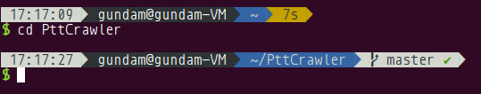
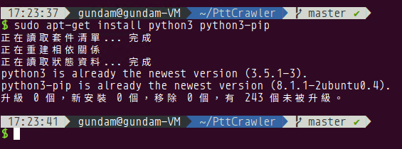

# PttCrawler

## Dependencies

* Python 3.x
* libssl-dev

## Installation

1. git clone

```bash
git clone https://github.com/GundamBox/PttCrawler.git
```


2. change directory

```bash
cd PttCrawler
```



3. Check Python and Pip Version

Must use Python3

```bash
sudo apt-get install python3 python3-pip
```



4. Install Package

```bash
sudo apt-get install libssl-dev
sudo pip3 install -r requirements.txt 
```


5. Copy `config_example.ini` as `config.ini`

```bash
cp config_example.ini config.ini
```


## Configuration

```ini
[Database]
# Database Url: [Type]://[Name]
# Currently only support SQLite
Type = sqlite
Name = ptt.db

[PttUser]
# term.ptt.cc every action delaytime
Delaytime = 2
# selenium webdriver folder
WebdriverFolder = webdriver
# term.ptt.cc bot login id/password
UserId = guest
UserPwd = guest
# Choices = {database, json, both}
Output = both

[PttArticle]
# Delaytime: delay time for each article
# NextPageDelaytime: delay time for each index
Delaytime = 2.0
NextPageDelaytime = 10.0
# request timeout
Timeout = 10
# Choices = {database, json, both}
Output = both
```

## Usage

### Crawler

1. PTT Article

```bash
python -m crawler article (--start-date | --index START_INDEX END_INDEX) [--config-path CONFIG_PATH]
```

2. PTT User last login record

```bash
python -m crawler user (--database | --ip IP) [--config-path CONFIG_PATH]
```

3. PTT Ip autonomous system number

```bash
python -m crawler asn (--database | --id ID) [--config-path CONFIG_PATH]
```

### Export

```bash
python export.py --format {ods, csv} --output-folder OUTPUT_FOLDER [--output-prefix OUTPUT_PREFIX]
```

### Schedule

1. Update

```bash
python schedule.py update {article, asn, user} -c CYCLE_TIME [-s START_DATETIME] [--virtualenv VIRTUALENV_PATH]
```

2. Remove

```bash
python schedule.py remove {article, asn, user}
```

## Todo

- [ ] PttArticleCrawler uses the `Scrapy` framework instead
- [ ] PttArticleCrawler's `crawling` method have to be divided into two, one is for fetching `index` and `web_id`, one is for fetching the article content corresponding to `web_id`

## Architecture

```
PttCrawler/
|- utils.py
|- export.py
|- query.py
|- schedule.py
|- config_example.ini
|- models/
|   |- __init__.py
|   |- article.py
|   |- asn.py
|   |- base.py
|   `- user.py
|- crawler/
|   |- __init__.py
|   |- __main__.py
|   |- article.py
|   |- asn.py
|   |- crawler_arg.py
|   |- user.py
|- webdriver/
|   |- windows/
|   |   `- chromedriver.exe
|   |- linux/
|   |   `- chromedriver
|   `- mac/
|       `- chromedriver
|- requirements.txt
|- env_wrapper.sh
|- CHANGELOG.md
|- README.md
`- README_ZH.md
```